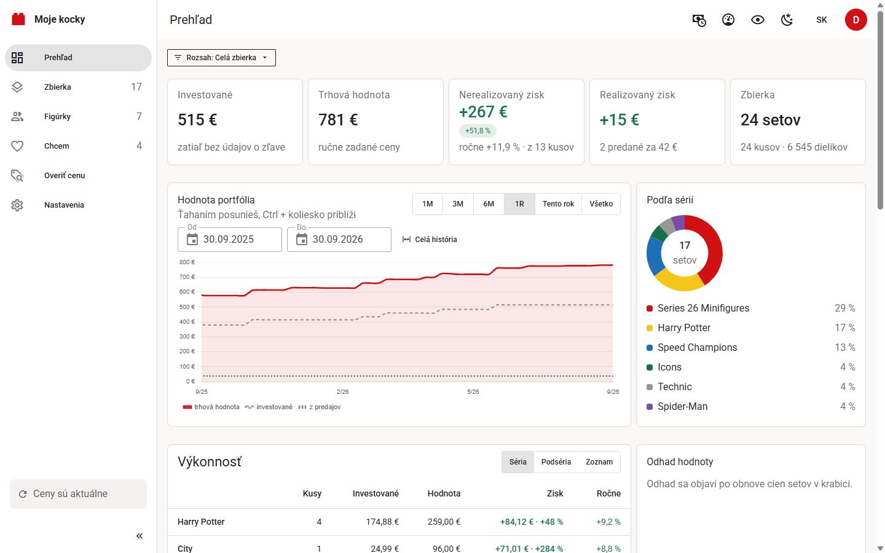

# Moje kocky

**[English version below](#english)**

Evidencia zbierky LEGO® setov pre jednu rodinu alebo pár známych, na vlastnom
serveri. Zadáš alebo naskenuješ set, Moje kocky dotiahnu názov, fotku,
dieliky a sériu z katalógu, ty doplníš kúpnu cenu, stav a kde ho máš uložený.
Potom vidíš trhovú hodnotu, zisk, ročný výnos a graf vývoja portfólia.
Predané kusy ostávajú v evidencii, takže vidíš aj to, koľko si na predaji
naozaj zarobil.

Moje kocky vznikli pre zberateľa, ktorý mal zbierku v tabuľke a chcel vedieť, čo
má, kde to má a koľko to dnes stojí. Nie je to obchod ani burza, len evidencia.
Aktuálna verzia je **1.2.0**.

- **Stránka projektu:** [jakubmatisak.github.io/moje-kocky](https://jakubmatisak.github.io/moje-kocky/)
  (zdroj v [github.com/jakubmatisak/moje-kocky](https://github.com/jakubmatisak/moje-kocky))
- **Webová verzia na vlastný server** (toto repo, Docker):
  [github.com/jakubmatisak/moje-kocky-webapp](https://github.com/jakubmatisak/moje-kocky-webapp)
- **Desktop pre Windows** (bez servera a bez Dockeru):
  [github.com/jakubmatisak/moje-kocky-desktop](https://github.com/jakubmatisak/moje-kocky-desktop),
  inštalátor je v [Releases](https://github.com/jakubmatisak/moje-kocky-desktop/releases/latest)



| Zbierka | Figúrky |
| --- | --- |
|  |  |

*Snímky sú z ukážkovej zbierky s vymyslenými, ručne zadanými cenami.*

## Čo to vie

**Evidencia**

- **Po kusoch.** Tri rovnaké sety sú tri záznamy, každý s vlastným stavom
  (v krabici, postavený, rozobratý…), cenou, dátumom a umiestnením.
- **Umiestnenie v dvoch úrovniach**: miestnosť a číslo krabice, s našepkávačom.
- **Mám to už?** Pri zadaní čísla sa ukáže výrazný pás, keď set v zbierke je.
- **Zbierka sú sety, figúrky majú vlastnú sekciu.** Figúrky zo sérií
  (zberateľské minifigúrky aj blind-boxy ako Mighty Machines) sú len
  v sekcii Figúrky a hromadne sa upravujú v detaile série. Keď hľadanie
  alebo filter v Zbierke trafí figúrku, Zbierka povie, koľko ich je vo
  Figúrkach, a odkáže tam. Prehľad, export CSV a súpis pre poistku počítajú
  všetko, sety aj figúrky.
- **Zberateľské minifigúrky.** Séria sa pridáva výberom z mriežky figúrok,
  nerozbalený sáčok sa po rozbalení priradí ku konkrétnej figúrke. Sekcia
  Figúrky pozná všetky série, aj nezačaté, a ukáže, čo chýba („Ukázať
  chýbajúce“ na Prehľade otvorí sériu rovno na chýbajúcich). „Kusy série“
  ukážu aj nerozbalené sáčky a predané figúrky. Rovnako blind-box série iných radov
  (Mighty Machines, Super Mario a pod.).
- **Série a vlny.** Koľko setov z témy a roku máš, podľa zoznamu Brickset.
- **Vlastné kategórie** s pravidlami (napr. všetko s „F1“ v názve naprieč
  sériami) aj ručným zaradením. Vyberieš aj založíš ich pri pridaní setu
  aj pri úprave kusu. Kategória patrí setu, nie jednotlivému kusu.
- **Chcem**: zoznam želaných setov s cieľovou cenou a poznámkou. Set, ktorý na
  cieľ klesol, sa zvýrazní. „Kúpil som“ ho presunie do zbierky.
- **Vlastné fotky kusu** (zmenšené do 1 MB, bez polohy GPS) a **súpis pre
  poistku** na tlač alebo do PDF.
- **Galéria ďalších oficiálnych fotiek setu** z Brickset (dá sa vypnúť).
- **Diely setu** z Rebrickable podľa farby, náhradné zvlášť, a **kontrola
  úplnosti** každého kusu: zadáš, koľko dielika je, kus potom nesie štítok
  „chýbajú N“ a zoznam chýbajúcich sa stiahne do CSV. **Čo ešte z neho
  postavíš**: alternatívne stavby z dielikov setu s odkazom na Rebrickable.
  Oboje sa stiahne raz na set, až keď kartu rozbalíš.

**Pridávanie**

- **Čítačka čiarových kódov** (USB, v režime klávesnice) aj **kamera** v
  prehliadači. Sken funguje z ktorejkoľvek obrazovky. Rovnaký kód zvýši
  počet, iný kód uloží rozpracovaný set a načíta nový; každé uloženie sa dá
  vrátiť tlačidlom Späť.
- **Pamäť formulára**: stav, dátum a umiestnenie z minulého setu sa predvyplnia.
- **Hromadný import** z Excelu alebo CSV so šablónou, náhľadom a vrátením.
  Export do CSV.
- **Bez kľúča Rebrickable** sa set dá uložiť ručne, len číslom.

**Peniaze**

- **Dva druhy zisku oddelene.** Nerealizovaný (trhová hodnota mínus kúpna
  cena toho, čo vlastníš) a realizovaný (čistý z predajov, po poplatkoch
  a poštovnom). Nikdy sa nesčítajú do jedného čísla.
- **Ročný výnos** kusu, série, zoznamu aj celej zbierky, od roka držania.
- **Bez ceny pomlčka, nie 0 €.** Kým kus nemá trhovú cenu, ukáže sa
  pomlčka alebo „cena neznáma“, nie 0 € a −100 %. Keď v skupine nemá cenu
  ani jeden kus, pomlčku ukáže aj Prehľad, Výkonnosť a súčty; pri čiastočnej
  cene je hodnota z ocenených kusov a vedľa nej „bez ceny: N“. Rovnako súpis
  a odkaz na pozretie; export CSV nechá bunku prázdnu a predaj pole ceny
  nevyplní. Cena odvodená z druhého stavu (postavený kus setu, ktorý sa ešte
  predáva) má znak ≈.
- **V dnešných peniazoch**: prepočet kúpnych cien infláciou (HICP Slovensko).
- **Mena zobrazenia**: sumy v eurách, korunách, dolároch, librách, zlotých,
  forintoch alebo frankoch, prepočítané dnešným kurzom ECB. Ukladá sa ďalej
  v eurách. Kúpu a predaj sa dá zadať aj v inej mene: na eurá sa prepočíta
  kurzom zo dňa kúpy a pôvodná suma ostane pri kuse.
- **Odhad hodnoty** kusov v krabici o 2 a 5 rokov.
- **Kto sa hýbe**: zmena trhovej ceny za 30, 90 a 365 dní.
- **Overiť cenu**: v obchode naskenuješ krabicu a hneď vidíš, čo to je, či to
  máš, cenu nového aj použitého kusu a graf histórie. Overené sety sa
  pamätajú v tabuľke.
- **Návrh ceny a text inzerátu** pre Aukro alebo Bazoš.
- **Skryť ceny** jedným klikom, keď niekomu ukazuješ portfólio.

**Prehľad a zoznamy**

- Filtre, ktoré sa skladajú (v skupine ALEBO, medzi skupinami A), hľadanie
  bez diakritiky, desať spôsobov zoradenia, uložené pohľady, karty alebo
  tabuľka, hromadná úprava vybraných kusov.
- Prehľad sa dá zúžiť na sériu, kategóriu, zoznam alebo uložený pohľad.
- **Odkaz na pozretie** zbierky alebo zoznamu Chcem, celého alebo len
  vybraných setov, bez hesla. Pri vypnutých sumách server ceny vôbec
  neposiela, nedajú sa nájsť ani v zdrojovom kóde stránky.

**Ostatné**

- Viac účtov na jednej inštancii, každý so svojou zbierkou a kľúčmi.
  Registráciu otvára a zatvára správca v Nastaveniach → Aplikácia.
- **Zapamätať si prihlásenie na tomto počítači**: so zaškrtnutým políčkom
  ostaneš prihlásený aj po zatvorení prehliadača, 30 dní od poslednej
  návštevy. Bez neho prihlásenie skončí so zatvorením prehliadača alebo
  po 12 hodinách bez návštevy. Zmena hesla hneď odhlási všetky ostatné
  zariadenia, tento prehliadač ostane prihlásený.
- Rozhranie po slovensky aj po anglicky, svetlý a tmavý režim, telefón aj
  počítač. Nastavenia zobrazenia sa pamätajú pri účte.
- Prehľad spotreby volaní cudzích služieb a prepínače, čo sa z ktorej
  služby smie sťahovať.
- Automatická záloha databázy pri každej aktualizácii a príkaz, ktorý ju
  vráti.

## Rýchly štart cez Docker

```bash
git clone https://github.com/jakubmatisak/moje-kocky-webapp.git
cd moje-kocky-webapp
cp .env.example .env
```

Do `.env` doplň aspoň `JWT_SECRET` (náhodný reťazec, aspoň 32 znakov). Potom:

```bash
docker compose up --build -d
```

Otvor `http://localhost:8000`. Prvý založený účet sa stane správcom.

Databáza je jeden súbor `data/lego.db`, fotky sú v `data/photos/`. Oboje leží
na zväzku mimo obrazu, takže nové nasadenie ich nezmaže.

Za HTTPS nastav v `.env` `COOKIE_SECURE=true`. Kamera na skenovanie ide len
cez HTTPS alebo na `localhost`.

Keď pošleš odkaz na svoju inštanciu alebo na verejnú zbierku cez Messenger,
WhatsApp či e-mail, ukáže sa náhľad s obrázkom a názvom (Open Graph). Verejný
odkaz ukáže meno a počet setov, sumy nikdy. Za proxy s vlastnou doménou nastav
`PUBLIC_URL` (napr. `https://kocky.example.sk`), aby mal náhľad správnu
adresu obrázka.

## Aktualizácia a zálohy

Aktualizácia je nové zostavenie z aktuálneho kódu:

```bash
git pull
docker compose up --build -d
```

Schéma databázy sa pri štarte sama posunie na najnovšiu verziu. Akú verziu
máš, ukazuje Nastavenia → Aplikácia (vidí ich správca) aj `/api/v1/health`,
napríklad `{"status": "ok", "version": "1.0.0"}`.

**Automatická záloha.** Pri prvom štarte každej inej verzie
(aktualizácia aj návrat na staršiu), aj keď sa schéma nemení, sa databáza
najprv skopíruje do `data/backups/`, napríklad
`lego-20261015-083000-v1.0.0-<revízia>.db`. Verzia v mene je tá, ktorá nad
databázou bežala naposledy, teda tá, na ktorú sa dá vrátiť; staršia
inštalácia, ktorá verziu ešte nezapisovala, má v mene len revíziu. Kópia ide
cez zálohovacie API SQLite, takže je celá aj pri otvorenom spojení. Keď sa
záloha nepodarí (plný disk, práva), migrácia sa nespustí a databáza ostane
bez zmeny.

- Po každom úspešnom štarte, aj keď sa nič nezálohovalo, ostane posledných
  **5 záloh** a žiadna staršia než **90 dní**; ostatné sa zmažú. Iné súbory
  v priečinku ostanú nedotknuté.
- Kým štart padá (Docker ho skúša znova), nemaže sa nič a nové kópie
  pokazeného stavu nepribúdajú; stále platí záloha spred aktualizácie.
- Nová inštalácia s prázdnou databázou sa nezálohuje.
- Automatická záloha je len databáza, fotky v nej nie sú.
- Zálohy obsahujú aj údaje účtov, ktoré sa medzitým zmazali, kým sa
  neprestriedajú, najdlhšie do prvého štartu po 90 dňoch. Spomínajú to aj
  zásady ochrany súkromia.

**Obnova zo zálohy.** Keby sa po aktualizácii niečo pokazilo:

1. Zastav kontajner: `docker compose stop`. Kde je záloha spred aktualizácie,
   napíše aj log: `docker compose logs app` (cesta `/app/data/backups/`
   v kontajneri je na disku `data/backups/`).
2. Vráť zálohu príkazom, kým kontajner stojí:

   ```bash
   docker compose run --rm app python -m lego_api.cli restore-backup lego-20261015-083000-v1.0.0-<revízia>.db
   ```

   Stačí meno súboru z `data/backups/`, alebo celá cesta v kontajneri
   (`/app/data/backups/…`). Mimo Dockeru je to
   `cd backend && uv run python -m lego_api.cli restore-backup <záloha>`.
   Súbor, ktorý nie je celá a čitateľná databáza zbierky, príkaz odmietne
   a nič nezmení. Doterajšiu databázu nemaže: aj so zvyškami žurnálu
   (`lego.db-journal`, `-wal`, `-shm`) ju odloží do `data/backups/` ako
   `lego-<čas>-pred-obnovou.db`, kde sa zmaže ako ostatné zálohy, a zálohu
   skopíruje na jej miesto. Nakoniec napíše, z ktorej verzie záloha je.

   Ručne, bez príkazu (ten je od verzie 1.0.1): zmaž
   `data/lego.db-journal`, `data/lego.db-wal` a `data/lego.db-shm`, ak tam
   sú, inak by SQLite zvyšok žurnálu pri ďalšom otvorení vrátil do
   obnoveného súboru a pokazil ho. Potom skopíruj zálohu na miesto databázy,
   napríklad
   `cp data/backups/lego-20261015-083000-v1.0.0-<revízia>.db data/lego.db`.
3. Vráť kód na verziu z mena zálohy a spusti `docker compose up --build -d`.
   Každé vydanie má tag: `git fetch --tags` a `git tag` vypíšu vydania,
   potom napríklad `git checkout v1.0.0`. Záloha, ktorá má v mene len
   revíziu, je z inštalácie spred verzie 1.0.0; vtedy vráť commit tesne pred
   „Moje kocky 1.0.0“ (nájdeš ho v `git log --oneline`). Novšia verzia by
   databázu pri štarte znova zmigrovala. K najnovšej sa neskôr vrátiš cez
   `git checkout main` a `git pull`.

**Ručná záloha** všetkého, databázy aj fotiek, je kópia priečinka `data/`,
najistejšie pri zastavenom kontajneri:

```bash
docker compose stop
cp -r data "zaloha-$(date +%F)"
docker compose start
```

## Kľúče k službám

Moje kocky fungujú aj bez kľúčov; vtedy je to evidencia, kde si názov setu
a cenu vyplníš sám. Každá služba pridá niečo navyše. Kde by údaj doplnila
služba, ktorú nemáš pripojenú, Moje kocky to povedia a ukážu, kde ju pripojiť;
Prehľad má kartu „Čo ešte Moje kocky vedia“ (dá sa skryť).

Kľúče nie sú v `.env`. **Každý používateľ si svoje vloží sám**,
v Nastaveniach na karte Dáta. Ukladajú sa zašifrované pri jeho účte a von
sa už nedostanú, rozhranie ukáže len ich koncovku. Šifra je odvodená
z `JWT_SECRET`; po jeho zmene treba kľúče zadať znova. Každý kľúč má vlastnú
dennú kvótu, nikto ju nemíňa niekomu inému.

| Služba | Na čo je | Cena a limit | Kľúč |
|---|---|---|---|
| [Rebrickable](https://rebrickable.com/api/) | názvy, roky, dieliky, fotky, série, figúrky, zoznam dielov, alternatívne stavby | zdarma, ~1 volanie/s | nastavenia účtu na rebrickable.com |
| [Brickset](https://brickset.com/article/52664/api-version-3-documentation) | pôvodná cena, čiarové kódy, popis, štítky, vlny sérií, ďalšie fotky setu | zdarma, 100 volaní/deň | [žiadosť o kľúč](https://brickset.com/tools/webservices/requestkey) |
| [BrickEconomy](https://www.brickeconomy.com/api-reference) | trhová cena nového a použitého kusu, história, odhady | súčasť Premium, 100 volaní/deň | profil na brickeconomy.com |
| [UPCitemdb](https://www.upcitemdb.com/) | záložné hľadanie podľa čiarového kódu | zdarma, bez kľúča, ~100 dotazov/deň na server | netreba, predvolene vypnuté |
| [Eurostat](https://ec.europa.eu/eurostat/) | inflácia pre prepočet do dnešných peňazí | zdarma, bez kľúča | netreba, predvolene vypnuté |
| [ECB](https://www.ecb.europa.eu/stats/policy_and_exchange_rates/euro_reference_exchange_rates/html/index.en.html) | kurzy pre menu zobrazenia a kúpu v cudzej mene | zdarma, bez kľúča, najviac raz denne | netreba, len pri inej mene než euro |

### Ako sa šetria volania

Nič sa nedeje samo od seba, nie je tu plánovač. Obnovu cien spúšťa tlačidlo
v hornej lište a beží na pozadí. Pred spustením sa dialóg spýta, koľko cien
obnoviť (predvolene 50, najviac toľko, koľko dnes ostáva) a ukáže, koľko
volaní je dnes použitých. Denná kvóta BrickEconomy je 100 volaní, preto:

1. Hromadná obnova sa nepýta na položku, na ktorú sa pýtala pred menej než
   týždňom (`PRICE_MAX_AGE_HOURS`), ani keď vtedy zdroj cenu nemal.
2. Na jedno spustenie najviac toľko položiek, koľko si vyberieš v dialógu
   (bez neho 40, `PRICE_REFRESH_BUDGET`). Najprv tie, ktorých cenu ešte
   nepoznáme (naposledy pridané prvé), potom od najstaršej; zvyšok pri
   ďalšom.
3. Platí zvyšok dennej kvóty (100 volaní, dá sa znížiť cez
   `BRICKECONOMY_DAILY_LIMIT`), po odpovedi 429 sa dávka zastaví.
4. Jedno volanie na set: odpoveď nesie cenu nového aj použitého kusu
   a históriu, takže nový aj postavený kus sa obnovia spolu.
5. Overiť cenu nepýta cenu, ktorá je mladšia než 24 hodín.

História cien príde v tej istej odpovedi, graf a „Kto sa hýbe“ teda majú čo
ukazovať hneď po pridaní setu. Brickset a Rebrickable majú v Nastaveniach
vlastné prepínače a rezervu, aby dopĺňanie na pozadí nezjedlo limit
potrebný na pridávanie.

## Vývoj

Potrebuješ Python 3.13 (cez [uv](https://docs.astral.sh/uv/)) a Node 22.

```bash
cd backend && uv run uvicorn lego_api.main:app --reload --port 8000
```

```bash
cd frontend && npm install && npm run dev
```

Frontend beží na `http://localhost:5173` a volania na `/api` posiela na
backend. Po zmene API sa typy pre frontend generujú z OpenAPI schémy:

```bash
cd backend && uv run python -m lego_api.openapi_export
```

```bash
cd frontend && npm run gen:api
```

Testy a kontroly:

```bash
cd backend && uv run pytest && uv run ruff check src tests && uv run ruff format src tests
```

```bash
cd frontend && npm run type-check && npm run lint && npm test
```

Testy poskytovateľov bežia proti uloženým odpovediam, bez siete a bez kľúčov;
ceny BrickEconomy v nich sú vymyslené. Verzia má jeden zdroj, `version`
v `backend/pyproject.toml`; pri vydaní sa zvýši aj v `uv.lock`,
`frontend/package.json` a `frontend/package-lock.json`, zhodu stráži
`tests/test_version.py`. README test nekontroluje, riadok „Aktuálna verzia“
(aj „The current version“ v anglickej časti) sa prepíše ručne. Vydanie
dostane tag `vX.Y.Z`, na ktorý sa dá pri obnove zo zálohy vrátiť.
Podrobný popis návrhu, dát, API a rozhodnutí je v
[docs/superpowers/specs/2026-09-10-lego-collection-design.md](docs/superpowers/specs/2026-09-10-lego-collection-design.md).

```
backend/     FastAPI, SQLAlchemy 2, SQLite, migrácie Alembic
frontend/    Vue 3, Vuetify 4, TypeScript, Pinia, vue-i18n, Chart.js
data/        databáza, zálohy a fotky, pripojené ako zväzok do kontajnera
design/      návrhy obrazoviek
docs/        specy, plány a snímky obrazovky
```

## Zdroje dát a poďakovanie

Moje kocky je nezávislý projekt fanúšika. Nie je spojený so skupinou LEGO
Group ani s nižšie uvedenými službami a nie je nimi sponzorovaný ani schválený.

LEGO® je ochranná známka skupiny spoločností LEGO Group, ktorá tento projekt
nesponzoruje, neautorizuje ani neschvaľuje. *(LEGO® is a trademark of the LEGO
Group of companies which does not sponsor, authorize or endorse this site.)*
Obrázky setov a minifigúrok sú chránené autorským právom LEGO Group
a zobrazujú sa len na nekomerčné informačné účely v súlade s pravidlami
[LEGO Fair Play](https://www.lego.com/en-us/legal/notices-and-policies/fair-play).

- **Katalóg setov, minifigúrok a obrázky:** [Rebrickable](https://rebrickable.com),
  cez [Rebrickable API](https://rebrickable.com/api/).
- **Pôvodné ceny, čiarové kódy, popisy, série, vlny a ďalšie fotky setov:**
  [Brickset](https://brickset.com), cez Brickset API v3. Image(s) courtesy of Brickset.com.
- **Trhové ceny a odhady hodnoty:** [BrickEconomy](https://www.brickeconomy.com),
  len pre používateľov s vlastným kľúčom BrickEconomy Premium. Ceny sú odhady
  BrickEconomy, nie investičné poradenstvo.
- **Vyhľadanie podľa čiarového kódu (záložné):** [UPCitemdb](https://www.upcitemdb.com).
- **Inflácia (HICP Slovensko):** Zdroj: Eurostat, dátový súbor
  [prc_hicp_minr](https://ec.europa.eu/eurostat/databrowser/view/prc_hicp_minr/default/table).
  Z indexu sa počíta prepočet cien do dnešných peňazí; je to úprava dát,
  za ktorú Eurostat nezodpovedá
  ([podmienky opätovného použitia](https://ec.europa.eu/eurostat/help/copyright-notice)).
- **Kurzy mien:** Zdroj: ECB, referenčné výmenné kurzy eura
  ([eurofxref](https://www.ecb.europa.eu/stats/policy_and_exchange_rates/euro_reference_exchange_rates/html/index.en.html)).
  Kurzami sa len prepočítavajú sumy, samotné kurzy sa nemenia.

Kľúče k službám patria jednotlivým používateľom a ich použitie sa riadi
podmienkami danej služby.

### Softvér tretích strán

Backend: [FastAPI](https://fastapi.tiangolo.com), [SQLAlchemy](https://www.sqlalchemy.org),
[Alembic](https://alembic.sqlalchemy.org), [Pydantic](https://docs.pydantic.dev),
[Uvicorn](https://www.uvicorn.org), [HTTPX](https://www.python-httpx.org),
[argon2-cffi](https://argon2-cffi.readthedocs.io), [PyJWT](https://pyjwt.readthedocs.io),
[cryptography](https://cryptography.io), [openpyxl](https://openpyxl.readthedocs.io),
[Pillow](https://python-pillow.org) (MIT-CMU) a ďalšie (MIT, BSD, ISC, Apache-2.0, PSF).
[certifi](https://github.com/certifi/python-certifi) (zoznam certifikačných
autorít pre HTTPX) je pod MPL-2.0 a používa sa nezmenený.

Frontend: [Vue](https://vuejs.org), [Vuetify](https://vuetifyjs.com),
[Pinia](https://pinia.vuejs.org), [Vue Router](https://router.vuejs.org),
[vue-i18n](https://vue-i18n.intlify.dev), [VueUse](https://vueuse.org),
[Chart.js](https://www.chartjs.org) s [vue-chartjs](https://vue-chartjs.org)
a chartjs-plugin-zoom, [openapi-fetch](https://openapi-ts.dev) (MIT);
čítanie kódov [ZXing-C++](https://github.com/zxing-cpp/zxing-cpp) cez
[zxing-wasm](https://github.com/Sec-ant/zxing-wasm) a [barcode-detector](https://github.com/Sec-ant/barcode-detector)
(Apache-2.0, MIT, BSD-3-Clause);
ikony [Material Design Icons](https://pictogrammers.com/library/mdi/) (Apache-2.0);
písmo [Roboto](https://github.com/googlefonts/roboto-classic) (SIL Open Font License 1.1).

Žiadna závislosť nie je pod GPL, AGPL ani LGPL.

## Licencia

Zdrojový kód je pod licenciou [MIT](LICENSE). Licencia sa nevzťahuje na dáta,
ceny a obrázky zo služieb tretích strán ani na ochrannú známku LEGO® a obrázky
výrobkov LEGO; tie patria svojim vlastníkom.

## Právne poznámky pre prevádzku

Nie je to právna rada, len to, ako Moje kocky riešia podmienky služieb (k septembru
2026). Podrobne v [specu](docs/superpowers/specs/2026-09-28-licencne-cista-architektura-design.md).

**Kým účet nezadá vlastný kľúč, zo služby nevidí nič.**

- **Rebrickable** (katalóg a fotky): API dovoľuje akékoľvek použitie.
  Spoločný katalóg vidí každý účet s vlastným kľúčom Rebrickable, bez neho
  len čísla setov.
- **Brickset a BrickEconomy** (osobné licencie): údaj sa ukladá raz, ale
  účet ho vidí, len keď si ho jeho vlastný kľúč sám stiahol. Ceny
  BrickEconomy len do času jeho posledného volania. Verejné odkazy z týchto
  služieb neukazujú nič.
- **UPCitemdb a Eurostat** nemajú kľúč: sú predvolene vypnuté, účet ich
  zapne sám v Nastaveniach → Dáta. Zdroj Eurostatu je uvedený vyššie.
- **Obrázky setov** idú cez server inštancie, takže tieto služby nevidia IP
  adresy návštevníkov.
- **GDPR:** stránka Zásady ochrany súkromia (prevádzkovateľa vyplní
  správca v Nastaveniach → Aplikácia), potvrdenie pri registrácii, export
  všetkých údajov a zmazanie účtu v Nastaveniach → Účet. Fotky sa ukladajú
  zmenšené a bez polohy GPS. Zásady spomínajú aj zálohy pri aktualizácii;
  po zmene ich textu sa každému účtu ukáže oznámenie, kým ho nepotvrdí.
  Používa sa len nevyhnutné cookie na prihlásenie (na 30 dní, len keď
  si používateľ zaškrtne zapamätanie), bez analytiky a reklamy, takže lišta
  so súhlasom netreba.

Čo zostáva na prevádzkovateľovi:

- **Nekomerčne.** Bez reklám, predplatného a affiliate odkazov. Pravidlá
  LEGO Fair Play aj licencia BrickEconomy platia len pre osobné, nekomerčné
  použitie.
- **Brickset** dáva kľúč „na testovanie a vzdelávanie“. Pri otvorenej
  verejnej inštancii mu napíš o súhlas.
- **BrickEconomy:** údaje sa na serveri ukladajú raz pre všetky kľúče ako
  vyrovnávacia pamäť (nikomu bez vlastného kľúča sa neukážu). Kto chce mať
  úplnú istotu, nech si vyžiada ich súhlas.
- **Slovo LEGO nepatrí do domény** ani do názvu verejnej stránky, logo LEGO
  sa nepoužíva.
- **HTTPS** a vyplnený prevádzkovateľ, keď sa registrujú cudzí ľudia.

---

<a id="english"></a>

# Moje kocky (English)

A self-hosted catalogue of a LEGO® set collection for one family or a few
friends. *Moje kocky* is Slovak for “my bricks”. You type in or scan a set and
the app fetches its name, picture, piece count and theme from the catalogue;
you add what you paid, its condition and where you keep it. From then on you
see the market value, profit, annual return and a chart of how the portfolio
has developed. Sold pieces stay on record, so you can also see what you
actually made on each sale.

The app was built for a collector who kept everything in a spreadsheet and
wanted to know what he has, where it is and what it is worth today. It is not
a shop or a marketplace, just a record of the collection. The current version
is **1.2.0**.

- **Project website:** [jakubmatisak.github.io/moje-kocky](https://jakubmatisak.github.io/moje-kocky/)
  (source at [github.com/jakubmatisak/moje-kocky](https://github.com/jakubmatisak/moje-kocky))
- **Web version for your own server** (this repository, Docker):
  [github.com/jakubmatisak/moje-kocky-webapp](https://github.com/jakubmatisak/moje-kocky-webapp)
- **Windows desktop app** (no server, no Docker):
  [github.com/jakubmatisak/moje-kocky-desktop](https://github.com/jakubmatisak/moje-kocky-desktop),
  the installer is under [Releases](https://github.com/jakubmatisak/moje-kocky-desktop/releases/latest)


| Collection | Minifigures |
| --- | --- |
|  |  |

*The screenshots show a sample collection with made-up, hand-entered prices.
The app's interface is available in Slovak and English.*

## Features

**Keeping track**

- **One record per physical copy.** Three identical sets are three records,
  each with its own condition (sealed, built, taken apart…), price, date and
  location.
- **Two-level location**: room and box number, with suggestions.
- **Do I already have it?** A prominent banner appears when the number you
  enter is already in the collection.
- **The Collection holds sets, minifigures have their own section.**
  Figures from series (collectible minifigures as well as blind boxes such as
  Mighty Machines) live only in the Minifigures section and are edited in
  bulk on the series page. When a search or filter in the Collection hits a
  figure, the Collection tells you how many are in Minifigures and links
  there. The Overview, the CSV export and the insurance inventory count
  everything, sets and figures alike.
- **Collectible minifigures.** You add a series by picking figures from a
  grid; a sealed bag can be matched to a specific figure once you open it.
  The Minifigures section knows every series, including ones you have not
  started, and shows what is missing (“Show missing” on the Overview opens a
  series straight on its missing figures). “Series pieces” also lists
  sealed bags and sold figures. Blind-box series from other lines (Mighty Machines,
  Super Mario and the like) work the same way.
- **Series and waves.** How many sets of a theme and year you own, based on
  the Brickset set list.
- **Custom categories** driven by rules (for example everything with “F1” in
  the name, across themes) or assigned by hand. You can pick or create them
  both when adding a set and when editing a piece. A category belongs to the
  set, not to an individual copy.
- **Wishlist**: sets you want, with a target price and a note. A set that has
  dropped to its target is highlighted. “I bought it” moves it into the
  collection.
- **Your own photos of each piece** (shrunk to at most 1 MB, GPS location
  removed) and an **insurance inventory** to print or save as PDF.
- **Gallery of additional official set pictures** from Brickset (can be
  switched off).
- **Set parts** from Rebrickable by colour, spares listed apart, and a
  **completeness check** for each piece: enter how many of a part you have,
  the piece then carries a “N parts missing” label and the missing parts
  list downloads as CSV. **What else you can build**: alternate builds from
  the set's parts with a link to Rebrickable. Both are fetched once per set,
  only when you expand the card.

**Adding sets**

- **Barcode scanner** (USB, in keyboard mode) or the **camera** in the
  browser. Scanning works from any screen. The same code again raises the
  quantity, a different code saves the set in progress and loads the new one;
  every save can be reverted with Undo.
- **Form memory**: condition, date and location from the previous set are
  filled in for you.
- **Bulk import** from Excel or CSV, with a template, a preview and undo.
  CSV export.
- **Without a Rebrickable key** you can still save a set by hand, by its
  number alone.

**Money**

- **Two kinds of profit, kept apart.** Unrealised (market value minus the
  purchase price of what you own) and realised (net from sales, after fees
  and postage). They are never added up into one number.
- **Annual return** for a piece, a theme, a list or the whole collection,
  once it has been held for a year.
- **No price means a dash, not €0.** Until a piece has a market price, the
  app shows a dash or “price unknown” rather than €0 and −100 %. When no piece
  in a group has a price, the Overview, Performance and the totals show a dash
  too; with partial prices you get the value of the priced pieces and “no
  price: N” next to it. The same goes for the inventory and the view-only
  link; the CSV export leaves the cell empty and the sale dialog leaves the
  price blank. A price borrowed from the other condition (a built copy of a
  set that is still on sale) is marked with ≈.
- **In today's money**: purchase prices adjusted for inflation (Slovak HICP).
- **Display currency**: amounts in euros, koruna, dollars, pounds, złoty,
  forint or francs, converted at today's ECB rate. Everything is still stored
  in euros. Purchases and sales can be entered in another currency too: they
  are converted at the rate of the purchase day and the original amount stays
  with the piece.
- **Value forecast** for sealed pieces 2 and 5 years ahead.
- **Biggest movers**: change in market price over 30, 90 and 365 days.
- **Check price**: scan a box in a shop and see right away what it is, whether
  you already own it, the price new and used, and a price history chart.
  Checked sets are kept in a table.
- **Suggested price and listing text** for Aukro or Bazoš (Slovak and Czech
  marketplaces).
- **Hide prices** with one click when you show the portfolio to someone.

**Overview and lists**

- Filters that combine (OR within a group, AND between groups), search that
  ignores diacritics, ten sort orders, saved views, cards or a table, and bulk
  editing of selected pieces.
- The Overview can be narrowed to a theme, a category, a list or a saved view.
- **View-only link** to the collection or the wishlist, whole or just chosen
  sets, no password needed. With amounts switched off, the server does not
  send prices at all, so they cannot be found even in the page source.

**Other**

- Several accounts on one instance, each with its own collection and keys.
  The administrator opens and closes registration in the app.
- **Remember me on this computer**: with the box ticked you stay signed in
  after closing the browser, for 30 days since your last visit. Without it,
  the sign-in ends when the browser closes or after 12 hours without a visit.
  Changing the password signs out every other device at once; this browser
  stays signed in.
- Slovak and English interface, light and dark mode, phone and desktop.
  Display settings are stored with the account.
- An overview of calls made to external services, and switches for what may
  be downloaded from which service.
- Automatic database backup on every app update, and a command that
  restores it.

## Quick start with Docker

```bash
git clone https://github.com/jakubmatisak/moje-kocky-webapp.git
cd moje-kocky-webapp
cp .env.example .env
```

Set at least `JWT_SECRET` in `.env` (a random string of 32 characters or
more). Then:

```bash
docker compose up --build -d
```

Open `http://localhost:8000`. The first account to register becomes the
administrator.

The database is a single file, `data/lego.db`, and photos are in
`data/photos/`. Both live on a volume outside the image, so a new deployment
does not wipe them.

Behind HTTPS, set `COOKIE_SECURE=true` in `.env`. The camera scanner only
works over HTTPS or on `localhost`.

When you send a link to the app or to a public collection via Messenger,
WhatsApp or e-mail, a preview with an image and a title appears (Open Graph).
A public link shows the name and the number of sets, never amounts. Behind a
proxy with your own domain, set `PUBLIC_URL` (e.g. `https://kocky.example.sk`)
so the preview gets the right image address.

## Updates and backups

Updating means rebuilding from the current code:

```bash
git pull
docker compose up --build -d
```

The database schema is upgraded automatically on startup. The running version
is shown in Settings → Application (visible to the administrator) and at
`/api/v1/health`, for example `{"status": "ok", "version": "1.0.0"}`.

**Automatic backup.** The first time any different version of the app starts
(an update or a downgrade), even when the schema does not change, the database
is first copied to `data/backups/`, for example
`lego-20261015-083000-v1.0.0-<revision>.db`. The version in the name is the
one that last ran on the database, so it is the one you can go back to; an
older installation that did not record its version yet gets only the
revision in the name. The copy is made through SQLite's backup API, so it is
complete even while a connection is open. If the backup fails (full disk,
permissions), the migration does not run and the database is left untouched.

- After every successful start, even one that backed nothing up, the
  **5 most recent backups** are kept and none older than **90 days**; the
  rest are deleted. Other files in the folder are left alone.
- While startup keeps failing (Docker retries it), nothing is deleted and no
  new copies of the broken state pile up; the backup from before the update
  remains the one to use.
- A fresh installation with an empty database is not backed up.
- The automatic backup covers the database only, not the photos.
- Until they rotate out, at the longest until the first start after
  90 days, backups still contain data of accounts deleted in the meantime.
  The in-app privacy policy mentions this as well.

**Restoring a backup.** If something goes wrong after an update:

1. Stop the app: `docker compose stop`. The log also tells you where the
   pre-update backup is: `docker compose logs app` (`/app/data/backups/`
   inside the container is `data/backups/` on disk).
2. Restore the backup with a command while the app is stopped:

   ```bash
   docker compose run --rm app python -m lego_api.cli restore-backup lego-20261015-083000-v1.0.0-<revision>.db
   ```

   The file name from `data/backups/` is enough, or the full path inside
   the container (`/app/data/backups/…`). Outside Docker it is
   `cd backend && uv run python -m lego_api.cli restore-backup <backup>`.
   The command refuses a file that is not a complete, readable database of
   the app and changes nothing. It does not delete the current database: it
   moves it, together with any leftover journal (`lego.db-journal`, `-wal`,
   `-shm`), to `data/backups/` as `lego-<time>-pred-obnovou.db`, where it is
   deleted like the other backups, and copies the backup into its place.
   Finally it tells you which version the backup comes from.

   By hand, without the command (the app has it since version 1.0.1):
   delete `data/lego.db-journal`, `data/lego.db-wal` and `data/lego.db-shm`
   if they exist, otherwise SQLite would replay the leftover journal into the
   restored file the next time it opens it and corrupt it. Then copy the
   backup over the database, for example
   `cp data/backups/lego-20261015-083000-v1.0.0-<revision>.db data/lego.db`.
3. Check out the app version named in the backup and run
   `docker compose up --build -d`. Every release has a tag:
   `git fetch --tags` and `git tag` list the releases, then for example
   `git checkout v1.0.0`. A backup with only the revision in its name comes
   from an installation older than 1.0.0; in that case check out the commit
   just before “Moje kocky 1.0.0” (you will find it in `git log --oneline`).
   A newer version would simply migrate the database again on startup. Later
   you get back to the latest version with `git checkout main` and `git pull`.

**A manual backup** of everything, database and photos, is a copy of the
`data/` folder, safest with the app stopped:

```bash
docker compose stop
cp -r data "backup-$(date +%F)"
docker compose start
```

## Service keys

The app works without any keys; it is then a plain record where you type in
set names and prices yourself. Each service adds something on top. Wherever a
service you have not connected would fill something in, the app says so and
points you to where to connect it; the Overview has a “What else the app can
do” card (which you can hide).

Keys are not in `.env`. **Every user enters their own in the app**, on the
Data tab in Settings. They are stored encrypted with the account and never
leave it again; the interface only shows their last few characters. The
encryption key is derived from `JWT_SECRET`, so after changing it the keys
have to be entered again. Each key has its own daily quota, and nobody uses up
anyone else's.

| Service | What it provides | Price and limit | Key |
|---|---|---|---|
| [Rebrickable](https://rebrickable.com/api/) | names, years, piece counts, pictures, themes, minifigures, parts lists, alternate builds | free, ~1 call/s | account settings on rebrickable.com |
| [Brickset](https://brickset.com/article/52664/api-version-3-documentation) | original price, barcodes, description, tags, theme waves, additional set pictures | free, 100 calls/day | [request a key](https://brickset.com/tools/webservices/requestkey) |
| [BrickEconomy](https://www.brickeconomy.com/api-reference) | market price new and used, history, forecasts | part of Premium, 100 calls/day | profile on brickeconomy.com |
| [UPCitemdb](https://www.upcitemdb.com/) | fallback barcode lookup | free, no key, ~100 lookups/day per server | not needed, off by default |
| [Eurostat](https://ec.europa.eu/eurostat/) | inflation for the today's-money conversion | free, no key | not needed, off by default |
| [ECB](https://www.ecb.europa.eu/stats/policy_and_exchange_rates/euro_reference_exchange_rates/html/index.en.html) | rates for the display currency and purchases in another currency | free, no key, at most once a day | not needed, only for a currency other than the euro |

### How calls are rationed

Nothing happens on its own; there is no scheduler. A price refresh is started
with the button in the top bar and runs in the background. Before it starts,
a dialog asks how many prices to refresh (50 by default, at most what is left
today) and shows how many calls were used today. BrickEconomy allows 100
calls a day, so:

1. A bulk refresh skips items it asked about less than a week ago
   (`PRICE_MAX_AGE_HOURS`), even when the source had no price then.
2. At most as many items per run as you pick in the dialog (40 without it,
   `PRICE_REFRESH_BUDGET`). Items with no known price go first (most
   recently added first), then the oldest; the rest wait for the next run.
3. The remaining daily quota is respected (100 calls, can be lowered with
   `BRICKECONOMY_DAILY_LIMIT`), and a 429 response stops the batch.
4. One call per set: the response carries both the new and the used price
   plus the history, so sealed and built copies are refreshed together.
5. Check price does not fetch a price younger than 24 hours.

Price history arrives in the same response, so the chart and Biggest movers
have something to show as soon as a set is added. Brickset and Rebrickable
have their own switches and reserve in Settings, so background enrichment does
not eat the quota needed for adding sets.

## Development

You need Python 3.13 (via [uv](https://docs.astral.sh/uv/)) and Node 22.

```bash
cd backend && uv run uvicorn lego_api.main:app --reload --port 8000
```

```bash
cd frontend && npm install && npm run dev
```

The frontend runs on `http://localhost:5173` and forwards calls to `/api` to
the backend. After an API change, the frontend types are generated from the
OpenAPI schema:

```bash
cd backend && uv run python -m lego_api.openapi_export
```

```bash
cd frontend && npm run gen:api
```

Tests and checks:

```bash
cd backend && uv run pytest && uv run ruff check src tests && uv run ruff format src tests
```

```bash
cd frontend && npm run type-check && npm run lint && npm test
```

Provider tests run against stored responses, with no network and no keys;
the BrickEconomy prices in them are made up. The app version has a single
source, `version` in `backend/pyproject.toml`; a release bumps it in
`uv.lock`, `frontend/package.json` and `frontend/package-lock.json` as well,
and `tests/test_version.py` checks that they match. The tests do not check
the README: the “Aktuálna verzia” line (and “The current version” in the
English part) is updated by hand. A release gets the tag `vX.Y.Z`, which you
can go back to when restoring a backup. The design, data model,
API and decisions are described in detail (in Slovak) in
[docs/superpowers/specs/2026-09-10-lego-collection-design.md](docs/superpowers/specs/2026-09-10-lego-collection-design.md).

```
backend/     FastAPI, SQLAlchemy 2, SQLite, Alembic migrations
frontend/    Vue 3, Vuetify 4, TypeScript, Pinia, vue-i18n, Chart.js
data/        database, backups and photos, mounted into the container as a volume
design/      screen designs
docs/        specs, plans and screenshots
```

## Data sources and credits

Moje kocky is an independent fan project. It is not affiliated with the LEGO
Group or with any of the services listed below, and is not sponsored or
endorsed by them.

LEGO® is a trademark of the LEGO Group of companies which does not sponsor,
authorize or endorse this site. Pictures of sets and minifigures are
copyrighted by the LEGO Group and are shown for non-commercial,
informational purposes only, in line with the
[LEGO Fair Play](https://www.lego.com/en-us/legal/notices-and-policies/fair-play)
guidelines.

- **Set and minifigure catalogue, pictures:** [Rebrickable](https://rebrickable.com),
  via the [Rebrickable API](https://rebrickable.com/api/).
- **Original prices, barcodes, descriptions, themes, waves and additional set
  pictures:** [Brickset](https://brickset.com), via the Brickset API v3.
  Image(s) courtesy of Brickset.com.
- **Market prices and value forecasts:** [BrickEconomy](https://www.brickeconomy.com),
  only for users with their own BrickEconomy Premium key. The prices are
  BrickEconomy estimates, not investment advice.
- **Barcode lookup (fallback):** [UPCitemdb](https://www.upcitemdb.com).
- **Inflation (Slovak HICP):** Source: Eurostat, dataset
  [prc_hicp_minr](https://ec.europa.eu/eurostat/databrowser/view/prc_hicp_minr/default/table).
  The app uses the index to convert prices into today's money; this is a
  modification of the data for which Eurostat is not responsible
  ([reuse policy](https://ec.europa.eu/eurostat/help/copyright-notice)).
- **Exchange rates:** Source: ECB, euro foreign exchange reference rates
  ([eurofxref](https://www.ecb.europa.eu/stats/policy_and_exchange_rates/euro_reference_exchange_rates/html/index.en.html)).
  The app only converts amounts with them and does not alter the rates.

Service keys belong to individual users, and their use is governed by the
terms of each service.

### Third-party software

Backend: [FastAPI](https://fastapi.tiangolo.com), [SQLAlchemy](https://www.sqlalchemy.org),
[Alembic](https://alembic.sqlalchemy.org), [Pydantic](https://docs.pydantic.dev),
[Uvicorn](https://www.uvicorn.org), [HTTPX](https://www.python-httpx.org),
[argon2-cffi](https://argon2-cffi.readthedocs.io), [PyJWT](https://pyjwt.readthedocs.io),
[cryptography](https://cryptography.io), [openpyxl](https://openpyxl.readthedocs.io),
[Pillow](https://python-pillow.org) (MIT-CMU) and others (MIT, BSD, ISC, Apache-2.0, PSF).
[certifi](https://github.com/certifi/python-certifi) (the certificate
authority bundle used by HTTPX) is under MPL-2.0 and is used unmodified.

Frontend: [Vue](https://vuejs.org), [Vuetify](https://vuetifyjs.com),
[Pinia](https://pinia.vuejs.org), [Vue Router](https://router.vuejs.org),
[vue-i18n](https://vue-i18n.intlify.dev), [VueUse](https://vueuse.org),
[Chart.js](https://www.chartjs.org) with [vue-chartjs](https://vue-chartjs.org)
and chartjs-plugin-zoom, [openapi-fetch](https://openapi-ts.dev) (MIT);
barcode reading by [ZXing-C++](https://github.com/zxing-cpp/zxing-cpp) via
[zxing-wasm](https://github.com/Sec-ant/zxing-wasm) and [barcode-detector](https://github.com/Sec-ant/barcode-detector)
(Apache-2.0, MIT, BSD-3-Clause);
icons from [Material Design Icons](https://pictogrammers.com/library/mdi/) (Apache-2.0);
the [Roboto](https://github.com/googlefonts/roboto-classic) typeface (SIL Open Font License 1.1).

No dependency is under the GPL, AGPL or LGPL.

## License

The source code is released under the [MIT](LICENSE) license. The license does
not cover data, prices or pictures from third-party services, nor the LEGO®
trademark and pictures of LEGO products; those belong to their owners.

## Legal notes for running an instance

This is not legal advice, only a description of how the app handles the terms
of the services it uses (as of September 2026). The details are in the
[spec](docs/superpowers/specs/2026-09-28-licencne-cista-architektura-design.md)
(in Slovak).

**Until an account enters its own key, it sees nothing from that service.**

- **Rebrickable** (catalogue and pictures): the API allows any use. The shared
  catalogue is visible to every account with its own Rebrickable key; without
  one, only set numbers.
- **Brickset and BrickEconomy** (personal licences): each piece of data is
  stored once, but an account only sees it if its own key fetched it.
  BrickEconomy prices are shown only up to the time of that key's last call.
  Public links show nothing from these services.
- **UPCitemdb and Eurostat** need no key: they are off by default and each
  account turns them on itself in Settings → Data. Eurostat is credited above.
- **Set pictures** are served through the app's own server, so these services
  never see visitors' IP addresses.
- **GDPR:** a privacy policy page (the administrator fills in the operator in
  Settings → Application), consent at registration, export of all data and
  account deletion in Settings → Account. Photos are stored shrunk and without
  GPS location. The policy also mentions the update backups; when its text
  changes, every account sees a notice until it confirms it. The app only
  uses the cookie strictly needed for signing in (kept for 30 days only when
  the user ticks "remember me"), with no analytics or ads, so no consent
  banner is required.

What remains up to the operator:

- **Non-commercial use.** No ads, subscriptions or affiliate links. Both the
  LEGO Fair Play guidelines and the BrickEconomy licence cover personal,
  non-commercial use only.
- **Brickset** issues keys “for testing and education”. If you run a public
  instance open to anyone, ask them for permission.
- **BrickEconomy:** the server stores the data once for all keys, as a cache
  (it is never shown to anyone without their own key). If you want to be
  completely sure, ask them for consent.
- **Keep the word LEGO out of the domain** and the name of a public site, and
  do not use the LEGO logo.
- **HTTPS** and a filled-in operator once strangers register.
